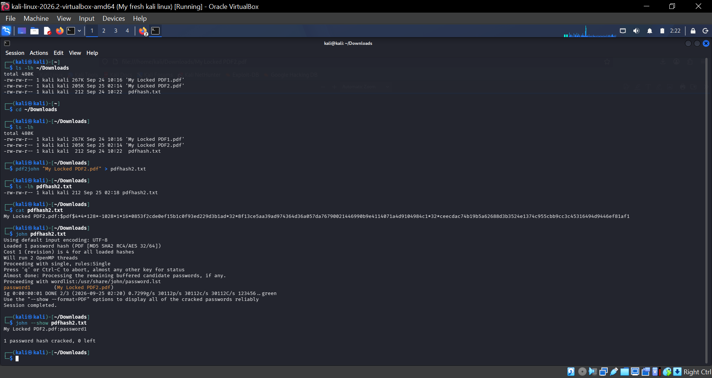

# PDF-Password-Cracking-Lab
A cybersecurity lab demonstrating PDF password cracking using John the Ripper and Networkwalks Hash Calculator and Password Cracker.


# Password Cracking Lab

## Introduction

Password cracking is the process of recovering a password from a protected file or stored password data.

In cybersecurity, password cracking can be used in authorized security testing to understand how strong or weak passwords are. Weak and common passwords can sometimes be discovered quickly, which shows why strong passwords are important.

In this project, I worked with password-protected PDF files and used two different methods to recover their passwords:

1. John the Ripper (JTR) on Kali Linux
2. Networkwalks Hash Calculator and Password Cracker

The purpose of this lab was to understand how password cracking works and to practice the process in a controlled environment.


## Project Overview

For this lab, I worked with three password-protected PDF files:

* My Locked PDF1.pdf
* My Locked PDF2.pdf
* My Locked PDF3.pdf

I used the first two PDFs to practice password cracking with John the Ripper.

For the third PDF, I used the Networkwalks Hash Calculator and Networkwalks Password Cracker, following the second method provided by my tutor.

The general process was:

was:

```text
Password-Protected PDF
        ↓
Extract PDF Hash
        ↓
Use Password Cracking Tool
        ↓
Recover Password
        ↓
Open the Protected PDF
```

# Tools Used

## John the Ripper

John the Ripper (JTR) is a password-cracking tool that can be used to test password strength by trying different password candidates against a password hash.

### pdf2john

pdf2john was used to extract the password hash from the protected PDF so that John the Ripper could work with it.

## Networkwalks Hash Calculator

The Networkwalks Hash Calculator was used to extract the hash from the protected PDF through a web browser.

## Networkwalks Password Cracker

The Networkwalks Password Cracker was then used to process the extracted PDF hash and recover the password.

## Kali Linux

Kali Linux was the environment used to perform the command-line part of the practical work.


# Lab Environment

The practical work was performed using:

* Kali Linux
* Firefox browser
* Terminal
* John the Ripper
* pdf2john
* Networkwalks Hash Calculator
* Networkwalks Password Cracker


## Method 1 — John the Ripper

For the first method, I used Kali Linux and John the Ripper.

## Step 1 — Download the PDF

The first PDF was downloaded into the Kali Downloads folder.

I checked the contents of the folder

The file My Locked PDF2.pdf was available in the Downloads folder.

## Step 2 — Move into the Downloads folder

I checked the contents of the folder using:


```bash
cd ~/Downloads
```

I then checked the files again:


```bash
ls -lh
```

### Step 3 — Extract the PDF Hash

I used pdf2john to extract the password hash from the protected PDF:

```bash
pdf2john "My Locked PDF2.pdf" > pdfhash2.txt
```

This created a file called:

```text
pdfhash2.txt
```

### Step 4 — Check the Extracted Hash

I checked the contents of the hash file:

```bash
cat pdfhash2.txt
```

The output contained a PDF hash beginning with:

```text
$pdf$
```

This hash was then used with John the Ripper.

### Step 5 — Crack the Password

I ran:

```bash
john pdfhash2.txt
```

John the Ripper processed the hash and successfully recovered the password.

### Step 6 — Display the Cracked Password

To display the recovered password, I used:

```bash
john --show pdfhash2.txt
```

The result showed that the password had been successfully cracked\.

The recovered password was:

```text
password1
```

The output also showed:

```text
1 password hash cracked, 0 left
```

This confirmed that John the Ripper successfully recovered the password\.


### Step 7 — Verify the Password

I used the recovered password to open the protected PDF and confirmed that the password worked\.


## Evidence

The screenshots below show the practical work completed using John the Ripper on Kali Linux.

### Kali Linux — JTR Password Cracking

The screenshot below shows the John the Ripper process carried out in the Kali Linux terminal.



### Successfully Cracked Password

The screenshot below shows the successful password recovery using John the Ripper.


# Method 2 — Networkwalks Tools

For the second method, I followed the method provided in the lab instructions.

This time I worked with:


```text
My Locked PDF3.pdf
```

Instead of using John the Ripper, I used the Networkwalks online tools.

Step 1 — Download My Locked PDF3.pdf

I downloaded:

```text
My Locked PDF3.pdf
```

to my Kali Linux Downloads folder.

I confirmed that the file was available using:

```bash
ls -lh ~/Downloads
```

## Step 2 — Open the Networkwalks Hash Calculator

I opened the Networkwalks Hash Calculator in Firefox:

https://networkwalks\.com/hash\-calculator/

The tool provides options for different types of files\.

Since I was working with a PDF, I selected the **PDF** option\.

## Step 3 — Upload the PDF

I selected:

```text
My Locked PDF3.pdf
```

from my Kali Downloads folder and uploaded it to the Hash Calculator\.

The tool processed the PDF and generated a hash\.

## Step 4 — Copy the PDF Hash

The generated hash started with:

```text
$pdf$
```

I copied the complete hash value\.

The complete hash was required because missing even part of the hash could prevent the Password Cracker from processing it correctly\.

## Step 5 — Open the Networkwalks Password Cracker

I then opened the Networkwalks Password Cracker:

https://networkwalks\.com/password\-cracker/

The purpose of this tool was to use the extracted PDF hash to recover the original password\.

## Step 6 — Enter the Hash

Since the extracted hash was text, I selected the **Text** option in the Password Cracker\.

I pasted the complete PDF hash beginning with:

```text
$pdf$
```

into the appropriate field\.

## Step 7 — Start the Password Cracking Process

I started the password\-cracking process using the Networkwalks Password Cracker\.

The tool tried password candidates against the supplied PDF hash\.

After the process completed, the recovered password was displayed by the tool\.

## Step 8 — Verify the Password

I used the recovered password to open:

```text
My Locked PDF3.pdf
```

This confirmed that the recovered password was correct\.
